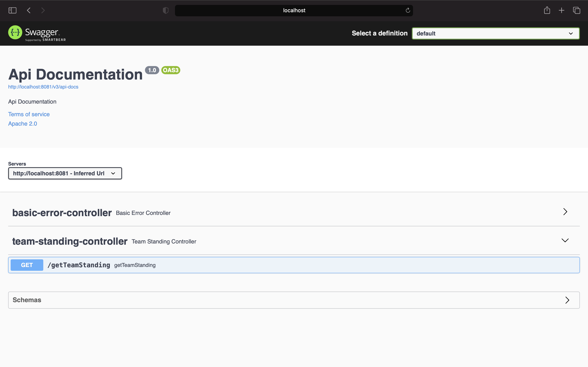
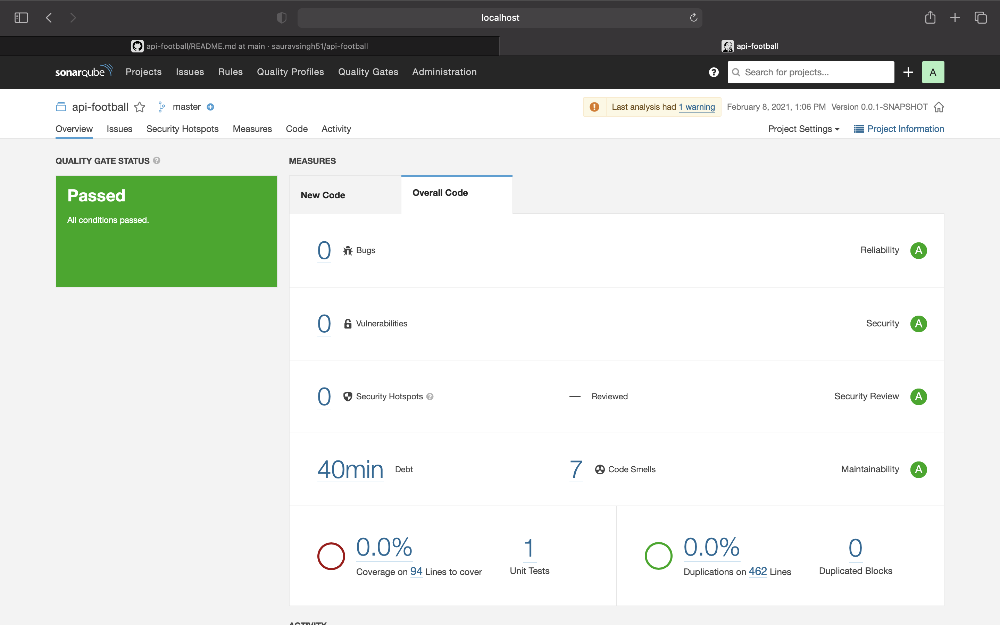

# api-football
 spring boot service to featch team standings
 
 Pre-Requisites
 --------------------------------------------
 1. Java 1.8
 2. Maven
 3. Docker
 4. Jenkins
 5. Sonarqube
 
 Instructions:
 --------------------------------------------
 1. Clone the repo 
 2. Create a Jenkins pipeline 
     a. in pipeline tab choose Definition as piepeline script from SCM
     b. enter the local repo location, active branch &  location of JenkinsFile
  
 3. The instance will go up on successfull completion of pipeline and can be accessed using the Swagger API document page at
    http://localhost:8080/swagger-ui/
    
 4. Use spring security token as password and "user" as username to login to the swagger-ui and access the api'
 
      

 5. TO run sonar analysis use mvn sonar:sonar -Dsonar.host.url=http://localhost:9000 -Dsonar.login=5bbd68121cee08e4e9de2df0d2d03cbe5e7d182d

      
